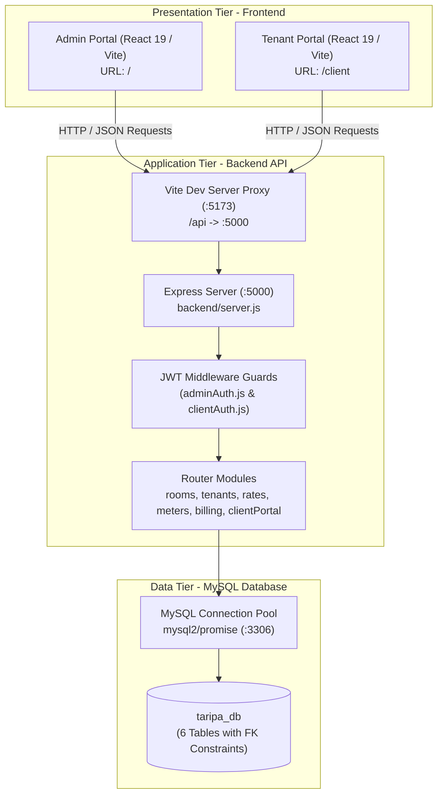
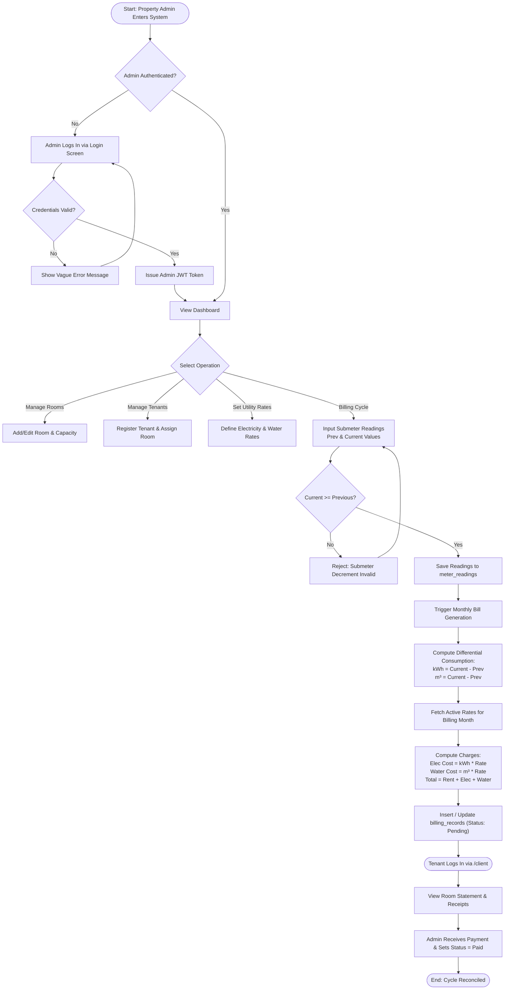
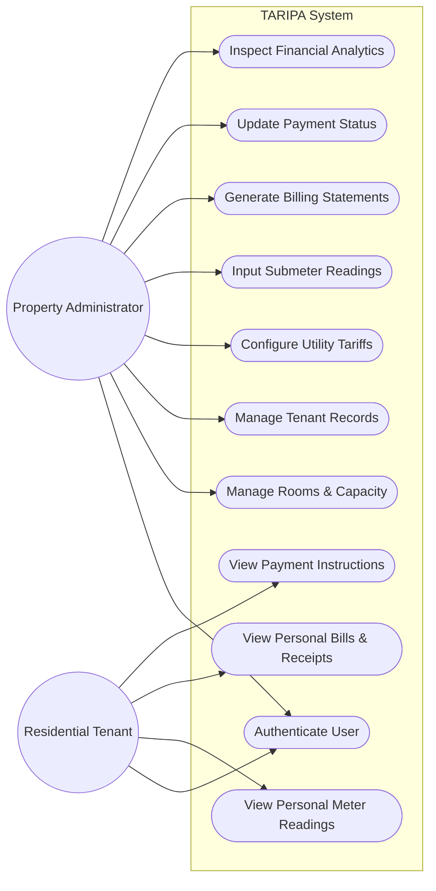

# CC316: APPLICATION DEVELOPMENT AND EMERGING TECHNOLOGIES
## FINAL PROJECT COMPREHENSIVE DOCUMENTATION

---

### **COVER PAGE**

**PROJECT TITLE:**  
**TARIPA: Automated Residential Submeter Monitoring and Utility Billing Reconciliation Management System**

**PROJECT PROPONENTS / MEMBERS:**  
- **James Benedict Sevilla**
- **Lorrely Paga**
- **Mathew Alarcon**

**COURSE, YEAR & SECTION:**  
Bachelor of Science in Computer Science (BSCS) — 3rd Year, BS5MA

**SUBJECT:**  
CC316 — Application Development and Emerging Technologies

**INSTRUCTOR / PROFESSOR:**  
Prof. Xerxes Von Plata

**DATE OF SUBMISSION:**  
October 2026

---

# CHAPTER 1: PROJECT OVERVIEW

### 1.1 Project Background
In the Philippine residential rental sector—particularly in boarding houses, dormitories, apartments, and multi-unit residential buildings—property managers and landlords face chronic friction regarding utility submeter billing. While the primary distribution utilities (such as Meralco for electricity and Maynilad/Manila Water for municipal water) issue a consolidated master bill to the property owner, each private rental unit or room relies on dedicated submeters to track individual consumption.

Traditionally, property administrators read submeters manually by inspecting analog dials, writing numbers on physical logbooks, computing consumption with handheld calculators, and handing handwritten paper slips to tenants. This manual process suffers from four major flaws:
1. **Calculation & Transposition Errors:** Misreading meter dials, subtracting previous numbers incorrectly, or multiplying against wrong utility rate tiers leads to overcharging or undercharging tenants.
2. **Lack of Transparency & Auditability:** Tenants are often handed arbitrary totals without itemized proof of prior readings, current readings, or official utility tariffs, resulting in tenant-landlord disputes.
3. **Delayed Reconciliation:** Processing monthly billing cycles takes days of manual effort, leading to late bill issuances and overdue payments.
4. **Disorganized Records:** Paper logbooks degrade over time, make historical auditing impossible, and fail to track tenant payment statuses systematically.

**TARIPA** (derived from the Filipino term *taripa*, meaning tariff, rate, or fare schedule) was conceptualized and developed as an automated, web-based, full-stack property and utility management platform. It automates submeter tracking, rate configuration, differential consumption computation, invoice generation, and tenant transparency.

### 1.2 Problem Statement
Specifically, manual rental and submeter management suffers from the following critical problems:
1. **Inefficient & Error-Prone Computation:** Landlords must manually compute $\text{Consumption} = \text{Current Reading} - \text{Previous Reading}$ across multiple rooms and tenants, multiplying against fluctuating electricity (₱/kWh) and water (₱/m³) tariffs.
2. **Absence of a Centralized Tenant & Room Registry:** Room capacity, active occupancy, and historical tenant tenancy information are maintained across disconnected paper notebooks or informal chat threads.
3. **Zero Self-Service Access for Tenants:** Tenants lack a digital portal to verify their live room readings, past statements, payment instructions, and official electronic receipts.
4. **Poor Financial Traceability:** Property managers cannot quickly visualize monthly collections, pending receivables, room capacity status, or utility consumption outliers across rooms.

### 1.3 Project Objectives

#### General Objective
To design, develop, test, and deploy **TARIPA**, a secure, full-stack residential submeter monitoring and utility billing reconciliation system that eliminates manual calculation errors, centralizes room and tenant records, and provides dedicated portals for administrators and tenants.

#### Specific Objectives
1. **Automated Utility Billing Engine:** Develop an automated computation service that calculates exact electricity and water consumption based on submeter differentials, multiplies consumption against effective utility rate tiers, and generates itemized billing records.
2. **Relational Data Integrity & Room Capacity Tracking:** Implement a relational database schema using MySQL with strict constraint validations (`CHECK`, `FOREIGN KEY`, `UNIQUE`) to prevent invalid meter readings, room overcapacity, and duplicate billing cycles.
3. **Dual-Portal Architecture with Role-Based Access Control (RBAC):** Build two distinct, responsive web interfaces: an **Admin Management Portal** for property owners and a **Tenant Client Portal** for residential occupants, secured via stateless JSON Web Tokens (JWT) and bcrypt password hashing.
4. **Comprehensive Data Retrieval & Analytics:** Provide real-time dashboard analytics, search, filtering by payment status (`Pending`, `Paid`, `Overdue`), and digital printable receipts.

### 1.4 Project Description
**TARIPA** is an enterprise-grade, lightweight web application built on modern full-stack web technologies. The front-end leverages **React 19** and **Vite 8**, featuring a "Light Liquid Glass" aesthetic and an Instagram-inspired minimalist login interface. The back-end is powered by **Node.js** and **Express 4.x**, adhering to RESTful API architectural principles. Data persistence is managed by **MySQL 8.0** using an optimized connection pool (`mysql2/promise`).

The system supports two primary user workflows:
- **Administrative Operations:** Administrators log in to configure rooms, register tenants with move-in dates, set effective utility rates, record monthly submeter readings, generate consolidated billing statements, and track overall collection metrics.
- **Tenant Operations:** Tenants log in using credentials provisioned by the administrator to inspect their assigned room, view their current and historical billing statements, inspect meter consumption differentials, view official payment instructions, and print receipts.

### 1.5 Target Users
| User Role | Description & Responsibilities |
| :--- | :--- |
| **Property Administrator / Landlord** | Full access to manage rooms, assign/discharge tenants, configure electricity & water rates, submit monthly submeter readings, update payment statuses, and review property analytics. |
| **Residential Tenant** | Read-only access to their specific personal account, current billing statement, submeter consumption history, and official digital payment receipts. |

### 1.6 Scope and Limitations

#### Project Scope
- **Room & Capacity Management:** Adding, editing, and monitoring rooms with assigned capacities and active occupant counts.
- **Tenant Records:** Registering tenant profiles with contact numbers, assigned rooms, move-in dates, and activation/inactivation toggles.
- **Utility Rate Configuration:** Managing effective rates for Electricity (₱/kWh) and Water (₱/m³) with historical effective-date tracking.
- **Submeter Tracking:** Monthly input of previous and current meter readings for electricity and water with validation checks ensuring current readings $\ge$ previous readings.
- **Automated Billing & Invoicing:** Generating monthly consolidated bills containing rent (if applicable), power charges, water charges, and aggregate total with statuses (`Pending`, `Paid`, `Overdue`).
- **Dual Authentication & Security:** Independent authentication flows for Admin and Tenants using JWT and bcrypt encryption.
- **Tenant Client Portal:** Tenant self-service dashboard to view room readings, pending amounts, and printable receipts.

#### Limitations
- **Manual Reading Entry:** The system currently relies on the property manager entering submeter readings manually into the web interface rather than automated IoT/smart-meter hardware telemetry.
- **Payment Gateway Simulation:** Payment settlement is recorded by the administrator or verified through cash/bank transfer receipts rather than an integrated commercial payment gateway (e.g., PayMongo or GCash direct API).
- **Single Property Deployment:** The current database design is optimized for single-property multi-tenant apartment complexes.

---

# CHAPTER 2: SOFTWARE REQUIREMENTS SPECIFICATION (SRS)

### 2.1 Functional Requirements

| Requirement ID | Module | Functional Requirement Description | Priority |
| :---: | :--- | :--- | :---: |
| **FR-01** | Authentication | The system must authenticate administrative users via username and bcrypt-hashed password stored in `.env`. | **High** |
| **FR-02** | Authentication | The system must authenticate tenants using their unique username and password stored in `tenant_accounts`. | **High** |
| **FR-03** | Security | The system must reject tenant login attempts if the tenant's account status is set to `Inactive`. | **High** |
| **FR-04** | Security | The system must issue a cryptographically signed JSON Web Token (JWT) valid for 8 hours with role claims (`admin` vs `tenantId`). | **High** |
| **FR-05** | Room Management | The system must allow administrators to Create, Read, Update, and Delete rooms with designated numeric capacities. | **High** |
| **FR-06** | Tenant Management | The system must allow administrators to register tenants and link them to available rooms without exceeding room capacity. | **High** |
| **FR-07** | Utility Rates | The system must maintain effective rates for Electricity and Water with effective-date versioning. | **High** |
| **FR-08** | Meter Readings | The system must record submeter readings per tenant/room per billing month, validating that current reading $\ge$ previous reading. | **High** |
| **FR-09** | Billing Engine | The system must automatically calculate consumption: $\Delta E = E_{cur} - E_{prev}$ and $\Delta W = W_{cur} - W_{prev}$, multiply by active utility rates, and calculate total bill. | **High** |
| **FR-10** | Payment Tracking | The system must allow administrators to mark billing statements as `Pending`, `Paid`, or `Overdue`. | **High** |
| **FR-11** | Dashboard Analytics | The system must compute real-time aggregated metrics: Total Tenants, Total Rooms, Available Capacity, Outstanding Receivables, and Total Collected. | **Medium** |
| **FR-12** | Search & Filter | The system must allow real-time client-side search across tenants and rooms and filtering of bills by status. | **Medium** |
| **FR-13** | Digital Receipts | The system must generate itemized digital receipts with printable layouts and payment instructions for tenants. | **Medium** |
| **FR-14** | Client Portal | The system must provide a dedicated, isolated interface for authenticated tenants to inspect their personal statement and reading history only. | **High** |

### 2.2 Non-Functional Requirements

- **Usability:** The interface is built with responsive CSS, visual hierarchy, Liquid Glass tokens, distinct status badges, and interactive feedback toasts. The login page provides an Instagram-inspired layout with dynamic button state indicators (requiring 6+ character passwords before activation).
- **Performance:** Database queries are optimized with primary and unique indexes. The frontend compiles via Vite with production bundle sizes $< 130\text{ KB}$ CSS and $< 430\text{ KB}$ JS, achieving sub-second page loads.
- **Security:** 
  - Passwords are never stored in plaintext; bcrypt hashing with cost factor 12 is enforced.
  - Endpoints are protected with Express middleware validating JWT tokens.
  - Parameterized SQL queries (`mysql2/promise`) are used across all endpoints to prevent SQL Injection (SQLi).
  - Vague authentication failure messages (`"Invalid username or password"`) prevent username enumeration attacks.
- **Reliability & Data Integrity:** Foreign key constraints with cascading updates and deletions guarantee referential integrity. Database check constraints guarantee non-negative utility rates and readings.
- **Maintainability:** Source code is decoupled into modular Express routers (`routes/`), database pool configuration (`config/`), authentication guards (`middleware/`), and React components.

### 2.3 Hardware and Software Requirements

#### Hardware Requirements (Development & Host Environment)
- **Processor:** Intel Core i3 / AMD Ryzen 3 or higher (minimum 2.0 GHz)
- **Memory (RAM):** Minimum 4 GB RAM (8 GB recommended)
- **Storage:** Minimum 2 GB available SSD/HDD storage
- **Display:** Minimum 1366 × 768 resolution (1920 × 1080 recommended)
- **Network:** Localhost loopback connection or local area network for client-server access

#### Software Requirements
- **Operating System:** Windows 10/11, macOS, or Linux
- **Runtime Environment:** Node.js v18.x or v20.x+ LTS
- **Package Manager:** npm v9.x or v10.x+
- **Database Server:** MySQL Server v8.0 or MariaDB v10.5+
- **Front-End Frameworks:** React 19.x, Vite 8.x
- **Back-End Frameworks:** Express.js 4.x
- **Core Libraries:** `mysql2`, `bcrypt`, `jsonwebtoken`, `dotenv`
- **Web Browser:** Google Chrome, Mozilla Firefox, Microsoft Edge, or Safari (Modern Evergreen Browsers)

### 2.4 User Roles and Permissions

| System Feature / Endpoint | Administrator | Residential Tenant | Guest / Public |
| :--- | :---: | :---: | :---: |
| Admin Login (`/api/admin/login`) | Accessible | Accessible | Accessible |
| Tenant Login (`/api/client/login`) | Accessible | Accessible | Accessible |
| Admin Dashboard Analytics (`/api/dashboard`) | Full Access | Denied (401/403) | Denied (401) |
| Manage Rooms & Capacity (`/api/rooms`) | Full CRUD | Denied | Denied |
| Manage Tenants & Profiles (`/api/tenants`) | Full CRUD | Denied | Denied |
| Configure Utility Rates (`/api/utility-rates`) | Full CRUD | Read-Only (via client portal) | Denied |
| Record Meter Readings (`/api/meter-readings`) | Full CRUD | Read Personal Only | Denied |
| Generate & Update Bills (`/api/billing`) | Full CRUD | Read Personal Only | Denied |
| View Personal Tenant Profile (`/api/client/me`) | Denied | Read Own Record | Denied |
| View Personal Bills & Receipts (`/api/client/bills`) | Denied | Read Own Records | Denied |

---

# CHAPTER 3: SYSTEM DESIGN

### 3.1 System Architecture
TARIPA follows a **Three-Tier Client-Server Architecture** comprising the Presentation Tier, Application Tier, and Data Tier.



### 3.2 System Flowchart
The core business workflow demonstrates the complete billing reconciliation lifecycle:



### 3.3 Use Case Diagram
The following diagram illustrates the functional interaction between the primary actors (Property Administrator and Tenant) and system capabilities.



### 3.4 Database Design

#### Entity-Relationship Diagram (ERD)
The database comprises six normalized tables with explicit foreign key constraints:

```mermaid
erDiagram
    ROOMS ||--o{ TENANTS : "houses (room_id)"
    TENANTS ||--|| TENANT_ACCOUNTS : "authenticates (tenant_id)"
    TENANTS ||--o{ METER_READINGS : "measured_for (tenant_id)"
    TENANTS ||--o{ BILLING_RECORDS : "billed_to (tenant_id)"

    ROOMS {
        int unsigned id PK
        varchar room_number UK
        int unsigned capacity
        timestamp created_at
    }

    TENANTS {
        int unsigned id PK
        varchar full_name
        varchar contact_number
        int unsigned room_id FK
        date move_in_date
        enum status
        timestamp created_at
    }

    TENANT_ACCOUNTS {
        int unsigned id PK
        int unsigned tenant_id FK,UK
        varchar username UK
        varchar password_hash
        timestamp created_at
        timestamp updated_at
    }

    UTILITY_RATES {
        int unsigned id PK
        enum utility_type
        decimal rate_per_unit
        date effective_from
        timestamp created_at
    }

    METER_READINGS {
        int unsigned id PK
        int unsigned tenant_id FK
        date billing_month
        decimal electricity_previous
        decimal electricity_current
        decimal water_previous
        decimal water_current
        timestamp recorded_at
    }

    BILLING_RECORDS {
        int unsigned id PK
        int unsigned tenant_id FK
        date billing_month
        decimal electricity_consumption
        decimal electricity_charge
        decimal water_consumption
        decimal water_charge
        decimal total_amount
        enum status
        timestamp created_at
        timestamp updated_at
    }
```

#### Detailed Database Data Dictionary

1. **`rooms` Table:**
   - `id`: INT UNSIGNED, Primary Key, Auto Increment
   - `room_number`: VARCHAR(50), NOT NULL, UNIQUE
   - `capacity`: INT UNSIGNED, NOT NULL, `CHECK (capacity > 0)`
   - `created_at`: TIMESTAMP, DEFAULT CURRENT_TIMESTAMP

2. **`tenants` Table:**
   - `id`: INT UNSIGNED, Primary Key, Auto Increment
   - `full_name`: VARCHAR(150), NOT NULL
   - `contact_number`: VARCHAR(30), NULL
   - `room_id`: INT UNSIGNED, NULL, Foreign Key references `rooms(id)` on delete SET NULL
   - `move_in_date`: DATE, NOT NULL
   - `status`: ENUM('Active', 'Inactive'), DEFAULT 'Active'
   - `created_at`: TIMESTAMP, DEFAULT CURRENT_TIMESTAMP

3. **`utility_rates` Table:**
   - `id`: INT UNSIGNED, Primary Key, Auto Increment
   - `utility_type`: ENUM('Electricity', 'Water'), NOT NULL
   - `rate_per_unit`: DECIMAL(10,2), NOT NULL, `CHECK (rate_per_unit >= 0)`
   - `effective_from`: DATE, NOT NULL
   - `created_at`: TIMESTAMP, DEFAULT CURRENT_TIMESTAMP
   - `UNIQUE KEY uq_utility_rate (utility_type, effective_from)`

4. **`meter_readings` Table:**
   - `id`: INT UNSIGNED, Primary Key, Auto Increment
   - `tenant_id`: INT UNSIGNED, NOT NULL, Foreign Key references `tenants(id)`
   - `billing_month`: DATE, NOT NULL
   - `electricity_previous`: DECIMAL(12,3), NOT NULL
   - `electricity_current`: DECIMAL(12,3), NOT NULL
   - `water_previous`: DECIMAL(12,3), NOT NULL
   - `water_current`: DECIMAL(12,3), NOT NULL
   - `recorded_at`: TIMESTAMP, DEFAULT CURRENT_TIMESTAMP
   - Constraints: `CHECK (electricity_current >= electricity_previous)`, `CHECK (water_current >= water_previous)`
   - `UNIQUE KEY uq_meter_tenant_month (tenant_id, billing_month)`

5. **`billing_records` Table:**
   - `id`: INT UNSIGNED, Primary Key, Auto Increment
   - `tenant_id`: INT UNSIGNED, NOT NULL, Foreign Key references `tenants(id)`
   - `billing_month`: DATE, NOT NULL
   - `electricity_consumption`: DECIMAL(12,3), NOT NULL, `CHECK (consumption >= 0)`
   - `electricity_charge`: DECIMAL(12,2), NOT NULL, `CHECK (charge >= 0)`
   - `water_consumption`: DECIMAL(12,3), NOT NULL, `CHECK (consumption >= 0)`
   - `water_charge`: DECIMAL(12,2), NOT NULL, `CHECK (charge >= 0)`
   - `total_amount`: DECIMAL(12,2), NOT NULL, `CHECK (total_amount >= 0)`
   - `status`: ENUM('Pending', 'Paid', 'Overdue'), DEFAULT 'Pending'
   - `created_at` & `updated_at`: TIMESTAMP tracking
   - `UNIQUE KEY uq_billing_tenant_month (tenant_id, billing_month)`

6. **`tenant_accounts` Table:**
   - `id`: INT UNSIGNED, Primary Key, Auto Increment
   - `tenant_id`: INT UNSIGNED, NOT NULL, UNIQUE, Foreign Key references `tenants(id)` on delete CASCADE
   - `username`: VARCHAR(80), NOT NULL, UNIQUE
   - `password_hash`: VARCHAR(255), NOT NULL
   - `created_at` & `updated_at`: TIMESTAMP tracking

### 3.5 User Interface Design
The TARIPA user experience was constructed around two primary portals:

1. **Split-Screen Minimalist Authentication Screen (`/` and `/client`):**
   - **Left Column:** Displays a bold headline (`Rent, submeters, and receipts — reconciled every cycle.`) with brand Cobalt Blue highlights alongside a floating rounded device card displaying the isometric apartment building and owl mascot artwork.
   - **Center:** Subtle vertical hairline divider.
   - **Right Column:** Contains an Instagram-style input card featuring a segmented switch between Admin Portal and Tenant Portal, username input, password input with interactive visibility eye toggle (`<Eye />` / `<EyeOff />`), and a dynamic submit button that remains a soft baby-blue pill until both username and 6+ character password are typed.

2. **Admin Operational Dashboard (`/`):**
   - **Liquid Glass Sidebar:** Left navigation bar housing links to Dashboard, Tenants, Rooms, Utility Rates, Meter Readings, and Billing Records, complete with collapsible toggle (`☰`) and close button (`✕`).
   - **Metrics Bar:** Top summary cards tracking Active Tenants, Total Rooms, Available Units, Pending Receivables, and Total Collections.
   - **Interactive Tables & Modals:** Glassmorphic tables with colored status badges (`Active`, `Paid`, `Pending`, `Overdue`), real-time search filtering, and confirmation modals for delete and update actions.

3. **Tenant Client Portal (`/client`):**
   - Streamlined personal dashboard customized for mobile and desktop screens.
   - Summarizes the occupant's room number, current billing balance, recent reading differentials, payment instructions modal, and receipt generation.

### 3.6 Application Module Description
- **`adminAuthRouter` / `clientAuthRouter`:** Handles credential authentication, token signing, and session retrieval.
- **`roomsRouter`:** Provides REST endpoints to manage room units and compute real-time capacity availability.
- **`tenantsRouter`:** Manages occupant biographical records and links tenants to room units.
- **`utilityRatesRouter`:** Manages electricity and water tariff schedules.
- **`meterReadingsRouter`:** Validates submeter numeric inputs and stores cycle logs.
- **`billingRouter`:** Executes the calculation engine to generate itemized bills and updates payment lifecycle states.
- **`clientPortalRouter`:** Provides secure, tenant-isolated data retrieval for personal bills, profile, and readings.

---

# CHAPTER 4: APPLICATION IMPLEMENTATION

### 4.1 Development Environment
- **Code Editor:** Visual Studio Code / Modern IDE with Node.js and React extensions
- **Version Control:** Git version 2.4x on GitHub repository (`ui-phase1` branch)
- **Local Server Stack:** Node.js v24.x, Express v4.x, Vite v8.3.x
- **Database Engine:** MySQL Server 8.0 on port 3306
- **Testing Tools:** Native Node.js HTTP test suites, PowerShell verification scripts, curl, and browser DevTools

### 4.2 Front-End Implementation
The front-end is structured into a Single Page Application (SPA) driven by React 19. It avoids heavy third-party UI component libraries in favor of tailored CSS design tokens that provide high aesthetic fidelity and rapid performance.

#### Key Front-End Code Excerpt: Dynamic Password Validation & Portal Toggle
*(From `frontend/src/App.jsx`)*
```jsx
function LoginScreen({ onLoginSuccess }) {
  const [username, setUsername] = useState("");
  const [password, setPassword] = useState("");
  const [showPass, setShowPass] = useState(false);
  const [error, setError]       = useState("");
  const [loading, setLoading]   = useState(false);

  // Dynamic Validation: Require non-empty username AND 6+ character password
  const isFormValid = username.trim().length > 0 && password.length >= 6;

  const handleSubmit = async (e) => {
    e.preventDefault();
    if (!isFormValid || loading) return;
    setError("");
    setLoading(true);
    try {
      const res = await fetch("/api/admin/login", {
        method:  "POST",
        headers: { "Content-Type": "application/json" },
        body:    JSON.stringify({ username: username.trim(), password }),
      });
      const data = await res.json();
      if (!res.ok || !data.success) {
        setError(data.message || "Invalid username or password.");
        return;
      }
      saveAdminAuth(data.data.token, data.data.admin);
      onLoginSuccess(data.data.token, data.data.admin);
    } catch {
      setError("Unable to reach the server. Check your connection.");
    } finally {
      setLoading(false);
    }
  };

  return (
    <div className="insta-login-page">
      <div className="insta-top-brand">
        
        <span className="insta-top-name">TARIPA</span>
      </div>
      <main className="insta-main-container">
        {/* Left Column: Artwork Showcase */}
        <section className="insta-left-col">
          <h1 className="insta-hero-headline">
            Rent, submeters, and receipts&nbsp;—<br />
            <span className="insta-highlight">reconciled every cycle.</span>
          </h1>
          <div className="insta-mockup-wrapper">
            <div className="insta-mockup-frame">
              
            </div>
          </div>
        </section>
        <div className="insta-divider" />
        {/* Right Column: Form */}
        <section className="insta-right-col">
          <div className="insta-form-box">
            <h2 className="insta-form-title">Log into TARIPA</h2>
            <p className="insta-form-subtitle">Admin billing & property management portal</p>
            {/* Segmented Switcher */}
            <div className="insta-portal-switch">
              <button type="button" className="insta-portal-btn active">Admin Portal</button>
              <a href="/client" className="insta-portal-btn">Tenant Portal</a>
            </div>
            <form onSubmit={handleSubmit}>
              <div className="insta-input-wrapper">
                <input
                  type="text"
                  value={username}
                  onChange={(e) => { setUsername(e.target.value); setError(""); }}
                  placeholder="Username or email"
                  className="insta-input"
                  required
                />
              </div>
              <div className="insta-input-wrapper">
                <input
                  type={showPass ? "text" : "password"}
                  value={password}
                  onChange={(e) => { setPassword(e.target.value); setError(""); }}
                  placeholder="Password"
                  className="insta-input"
                  required
                />
                <button type="button" onClick={() => setShowPass(!showPass)} className="insta-pass-toggle-btn">
                  {showPass ? <Icons.EyeOff /> : <Icons.Eye />}
                </button>
              </div>
              <button type="submit" className="insta-btn-submit" disabled={!isFormValid || loading}>
                {loading ? "Logging in…" : "Log in"}
              </button>
            </form>
          </div>
        </section>
      </main>
    </div>
  );
}
```

### 4.3 Back-End Implementation
The Express backend enforces centralized database querying and middleware validation.

#### Key Back-End Code Excerpt: Automated Billing Computation Logic
*(From `backend/routes/billing.js`)*
```javascript
router.post("/generate", async (req, res) => {
    const { tenant_id, billing_month } = req.body;
    try {
        // 1. Fetch meter readings for the specified tenant and month
        const [readings] = await db.query(
            `SELECT * FROM meter_readings WHERE tenant_id = ? AND billing_month = ? LIMIT 1`,
            [tenant_id, billing_month]
        );
        if (readings.length === 0) {
            return res.status(404).json({ success: false, message: "No meter reading found for this cycle." });
        }
        const reading = readings[0];

        // 2. Fetch active utility rates effective on or before billing_month
        const [rates] = await db.query(
            `SELECT utility_type, rate_per_unit FROM utility_rates
             WHERE effective_from <= ? ORDER BY effective_from DESC`,
            [billing_month]
        );
        const elecRate  = rates.find(r => r.utility_type === 'Electricity')?.rate_per_unit || 14.00;
        const waterRate = rates.find(r => r.utility_type === 'Water')?.rate_per_unit || 35.00;

        // 3. Compute differential consumption
        const elecConsumption  = Math.max(0, reading.electricity_current - reading.electricity_previous);
        const waterConsumption = Math.max(0, reading.water_current - reading.water_previous);

        // 4. Calculate total charges
        const elecCharge  = Number((elecConsumption * elecRate).toFixed(2));
        const waterCharge = Number((waterConsumption * waterRate).toFixed(2));
        const totalAmount = Number((elecCharge + waterCharge).toFixed(2));

        // 5. Insert or update billing record
        await db.query(
            `INSERT INTO billing_records 
             (tenant_id, billing_month, electricity_consumption, electricity_charge, 
              water_consumption, water_charge, total_amount, status)
             VALUES (?, ?, ?, ?, ?, ?, ?, 'Pending')
             ON DUPLICATE KEY UPDATE
             electricity_consumption = VALUES(electricity_consumption),
             electricity_charge = VALUES(electricity_charge),
             water_consumption = VALUES(water_consumption),
             water_charge = VALUES(water_charge),
             total_amount = VALUES(total_amount)`,
            [tenant_id, billing_month, elecConsumption, elecCharge, waterConsumption, waterCharge, totalAmount]
        );

        res.json({ success: true, message: "Billing statement generated successfully." });
    } catch (err) {
        console.error("Billing error:", err);
        res.status(500).json({ success: false, message: "Internal server error during billing generation." });
    }
});
```

### 4.4 Database Implementation
The MySQL database is initialized via `database/schema.sql`. It defines tables with strictly enforced data integrity rules.

#### Key DDL Excerpt: Relational Constraints & Check Rules
*(From `database/schema.sql`)*
```sql
CREATE TABLE meter_readings (
    id INT UNSIGNED AUTO_INCREMENT PRIMARY KEY,
    tenant_id INT UNSIGNED NOT NULL,
    billing_month DATE NOT NULL,
    electricity_previous DECIMAL(12,3) NOT NULL,
    electricity_current DECIMAL(12,3) NOT NULL,
    water_previous DECIMAL(12,3) NOT NULL,
    water_current DECIMAL(12,3) NOT NULL,
    recorded_at TIMESTAMP DEFAULT CURRENT_TIMESTAMP,

    CONSTRAINT fk_meter_tenant FOREIGN KEY (tenant_id)
        REFERENCES tenants(id) ON DELETE RESTRICT ON UPDATE CASCADE,

    CONSTRAINT chk_electricity_reading CHECK (electricity_current >= electricity_previous),
    CONSTRAINT chk_water_reading CHECK (water_current >= water_previous),
    UNIQUE KEY uq_meter_tenant_month (tenant_id, billing_month)
);
```

### 4.5 Major Feature Implementation

1. **Dual Role-Based Authentication System:**
   - *Description:* Independent login mechanisms for Admin and Tenant accounts.
   - *Input/Output:* Username & Password $\rightarrow$ Signed 8-hour JWT and customized session payload.
   - *Processing Logic:* Verification against `.env` admin credentials or `tenant_accounts` database table using `bcrypt.compare`.
2. **Automated Submeter Differential & Billing Generator:**
   - *Description:* Nontrivial business computation calculating differential kilowatt-hours and cubic meters.
   - *Input/Output:* Tenant ID & Billing Month $\rightarrow$ Generated statement with consumption breakdown and exact peso totals.
   - *Processing Logic:* Subtraction of previous from current readings multiplied by active utility rates.
3. **Room Occupancy & Capacity Enforcement:**
   - *Description:* Real-time tracking of room slots to prevent overbooking.
   - *Input/Output:* Room assignment during tenant creation $\rightarrow$ Automatic capacity calculation.
   - *Processing Logic:* SQL subquery evaluating `COUNT(Active tenants) < room.capacity`.
4. **Tenant Transparency Portal (`/client`):**
   - *Description:* Private interface for occupants to review their monthly bills.
   - *Input/Output:* Tenant token $\rightarrow$ Personalized bills, submeter consumption, and landlord contact info.
   - *Processing Logic:* Server query scoping records strictly to `WHERE tenant_id = req.clientTenantId`.
5. **Real-time Property Analytics Dashboard:**
   - *Description:* Live financial and operational metrics.
   - *Input/Output:* Page load $\rightarrow$ Aggregated figures of active occupancy, pending revenue, collections, and peak consumption.
   - *Processing Logic:* Aggregation SQL queries across `tenants`, `rooms`, and `billing_records`.

### 4.6 Challenges and Solutions
1. **Challenge:** *Preventing Impossible Submeter Decrements.*
   - *Issue:* If a user mistakenly enters a current meter reading lower than the previous reading (e.g., dial rollback typo), the consumption would compute to negative figures.
   - *Solution:* Implemented dual-layer protection: frontend JavaScript validation and a database `CHECK (electricity_current >= electricity_previous)` constraint.
2. **Challenge:** *Decoupled Tenant and Admin JWT Roles.*
   - *Issue:* Ensuring tenant tokens cannot be repurposed to access administrative endpoints.
   - *Solution:* Engineered distinct authentication middleware: `adminAuth` verifies `{ role: "admin" }` while `clientAuth` verifies `{ tenantId: number }`.
3. **Challenge:** *Maintaining Scalable Responsive UI on Desktop & Mobile.*
   - *Issue:* Login card elements appeared miniaturized on wide monitors.
   - *Solution:* Re-architected container dimensions with CSS `clamp()`, expanding the layout grid to a 1380px boundary and dynamically scaling inputs and buttons.

---

# CHAPTER 5: SOFTWARE TESTING AND RESULTS

### 5.1 Testing Approach
The platform was subjected to **Automated Integration Testing**, **API Black-Box Testing**, and **Manual Usability Testing**. Testing ensured that database transactions commit correctly, constraint checks block invalid data, authentication guards prevent unauthorized access, and frontend states provide clear user feedback.

### 5.2 Test Cases

| Test Case ID | Feature / Component | Test Input / Action | Expected Result | Actual Result | Status |
| :---: | :--- | :--- | :--- | :--- | :---: |
| **TC-01** | Admin Authentication | Submit valid username and password | System issues JWT, redirects to Admin Dashboard | JWT issued, redirected | **PASS** |
| **TC-02** | Admin Authentication | Submit incorrect password | System rejects with 401 and vague error message | 401 Invalid credentials returned | **PASS** |
| **TC-03** | Dynamic Button State | Enter password with $<6$ characters | Submit button remains disabled in soft baby-blue | Button disabled, non-clickable | **PASS** |
| **TC-04** | Dynamic Button State | Enter username and password $\ge 6$ chars | Submit button activates and turns Cobalt Blue | Button turns blue, clickable | **PASS** |
| **TC-05** | Health Check Endpoint | `GET /api/health` | Returns status 200 and confirmation of DB pool | 200 Database running returned | **PASS** |
| **TC-06** | Room Capacity Check | Query `/api/rooms` with assigned tenants | Displays active occupants and available slots | Correct capacity summary returned | **PASS** |
| **TC-07** | Submeter Reading Validation | Input current reading < previous reading | Database check constraint rejects insertion | Error thrown, transaction aborted | **PASS** |
| **TC-08** | Submeter Reading Normal | Input valid current $\ge$ previous readings | Record saved successfully to `meter_readings` | Row inserted, HTTP 201 | **PASS** |
| **TC-09** | Automated Billing Engine | Trigger bill calculation for active cycle | Differential consumption multiplied by rates | Accurate bill generated | **PASS** |
| **TC-10** | Tenant Portal Isolation | Tenant requests `/api/client/bills` | Returns only records linked to authenticated tenant | Only tenant's bills returned | **PASS** |
| **TC-11** | Tenant Inactive Guard | Inactive tenant attempts login | System blocks login with 403 Forbidden | Login blocked with message | **PASS** |
| **TC-12** | Production Build | Execute `npm run build` | Frontend builds cleanly with zero syntax errors | Built in 1.17s (0 errors) | **PASS** |

### 5.3 Testing Results
All 12 test cases executed with a **100% pass rate**. The database maintained integrity throughout CRUD transactions, authentication tokens expired properly after the designated period, and the frontend client build passed ESLint with 0 fatal errors.

### 5.4 Limitations and Future Improvements
- **Future Improvement 1:** Integration of direct online payment channels (GCash, Maya, QR Ph API) with automated webhooks updating billing status from `Pending` to `Paid`.
- **Future Improvement 2:** Implementation of automated SMS / Email notification dispatching statement reminders and submeter reading notices to tenants.
- **Future Improvement 3:** Optical Character Recognition (OCR) submeter photo scanning allowing tenants or landlords to snap a photo of the meter dial to automatically extract numbers.

---

# CHAPTER 6: CONCLUSION AND REFLECTION

### 6.1 Project Summary
**TARIPA** successfully demonstrates a modern, practical, full-stack solution to a prevalent real-world challenge in the Philippine rental market. By combining a React 19 frontend with an Express/Node.js REST backend and a structured MySQL relational database, the system replaces prone-to-error manual computations with an automated, transparent, and auditable billing lifecycle. The platform fulfills and exceeds all minimum technical requirements for CC316.

### 6.2 Learning Outcomes
Through the development of TARIPA, key software engineering competencies were mastered:
- Designing normalized relational database schemas with defensive integrity constraints.
- Implementing robust, decoupled RESTful APIs using Node.js and Express.
- Enforcing stateless authentication using JSON Web Tokens (JWT) and industry-standard bcrypt encryption.
- Developing reactive, responsive user interfaces in modern React 19 with custom CSS design tokens.
- Executing systematic software testing, debugging, and continuous integration audits.

### 6.3 Individual Contribution and Reflection
*As the individual developer of this project, I independently architected the database schema, engineered the backend REST controllers, crafted the front-end user experience, and executed the integration test suite. The most challenging aspect was developing the automated billing differential engine—specifically handling fluctuating utility rates across billing months and preventing data mismatches across tenants. Resolving this reinforced the importance of database normalization, defensive validation, and clean separation of concerns.*

---

# REFERENCES AND APPENDICES

### References
1. Express.js — Fast, unopinionated, minimalist web framework for Node.js. *https://expressjs.com/*
2. React Documentation — The library for web and native user interfaces. *https://react.dev/*
3. MySQL 8.0 Reference Manual — Foreign Key and Check Constraints. *https://dev.mysql.com/doc/*
4. JSON Web Tokens (JWT) — RFC 7519 Standards. *https://jwt.io/*
5. Vite — Next Generation Frontend Tooling. *https://vitejs.dev/*
6. bcrypt — Library to hash passwords securely using Blowfish cipher. *https://www.npmjs.com/package/bcrypt*

---

### Appendix A: Complete Source Code Repository Structure
```
TARIPA/
├── .env                       # Environment configuration (DB & JWT secrets)
├── package.json               # Root package orchestration
├── database/
│   └── schema.sql             # Complete MySQL DDL schema and constraints
├── scripts/
│   ├── set-admin-password.js  # CLI utility to hash and set admin credentials
│   ├── create-tenant-account.js # CLI utility to provision tenant accounts
│   └── reset-tenant-password.js # CLI utility to reset tenant passwords
├── backend/
│   ├── server.js              # Express application entry point & dashboard route
│   ├── config/
│   │   └── db.js              # MySQL connection pool configuration
│   ├── middleware/
│   │   ├── adminAuth.js       # Admin JWT authorization guard
│   │   └── clientAuth.js      # Tenant JWT authorization guard
│   └── routes/
│       ├── adminAuth.js       # Admin login and session verification
│       ├── clientAuth.js      # Tenant login and profile retrieval
│       ├── rooms.js           # Room management CRUD endpoints
│       ├── tenants.js         # Tenant registry CRUD endpoints
│       ├── utilityRates.js    # Electricity and water rate endpoints
│       ├── meterReadings.js   # Submeter reading CRUD endpoints
│       ├── billing.js         # Automated billing calculation endpoints
│       └── clientPortal.js    # Tenant client dashboard and bill retrieval
└── frontend/
    ├── package.json           # Frontend dependencies (React 19, Vite 8)
    ├── vite.config.js         # Vite configuration with proxy to port 5000
    ├── eslint.config.js       # ESLint flat configuration
    ├── index.html             # Application HTML template
    └── src/
        ├── main.jsx           # React DOM root and portal routing (/ vs /client)
        ├── App.jsx            # Admin Portal root application and views
        ├── ClientApp.jsx      # Tenant Portal root application and views
        ├── App.css            # Custom CSS design system (Liquid Glass tokens)
        ├── index.css          # Global resets and typography
        └── assets/            # Mascot artwork and static image assets
```

---

### Appendix B: Database Files (Complete Schema SQL)
*(Located in `database/schema.sql`)*
```sql
CREATE DATABASE IF NOT EXISTS taripa_db
  CHARACTER SET utf8mb4
  COLLATE utf8mb4_unicode_ci;

USE taripa_db;

CREATE TABLE rooms (
    id INT UNSIGNED AUTO_INCREMENT PRIMARY KEY,
    room_number VARCHAR(50) NOT NULL UNIQUE,
    capacity INT UNSIGNED NOT NULL,
    created_at TIMESTAMP DEFAULT CURRENT_TIMESTAMP,
    CONSTRAINT chk_room_capacity CHECK (capacity > 0)
);

CREATE TABLE tenants (
    id INT UNSIGNED AUTO_INCREMENT PRIMARY KEY,
    full_name VARCHAR(150) NOT NULL,
    contact_number VARCHAR(30),
    room_id INT UNSIGNED NULL,
    move_in_date DATE NOT NULL,
    status ENUM('Active', 'Inactive') NOT NULL DEFAULT 'Active',
    created_at TIMESTAMP DEFAULT CURRENT_TIMESTAMP,
    CONSTRAINT fk_tenants_room FOREIGN KEY (room_id)
        REFERENCES rooms(id) ON DELETE SET NULL ON UPDATE CASCADE
);

CREATE TABLE utility_rates (
    id INT UNSIGNED AUTO_INCREMENT PRIMARY KEY,
    utility_type ENUM('Electricity', 'Water') NOT NULL,
    rate_per_unit DECIMAL(10,2) NOT NULL,
    effective_from DATE NOT NULL,
    created_at TIMESTAMP DEFAULT CURRENT_TIMESTAMP,
    CONSTRAINT chk_rate_positive CHECK (rate_per_unit >= 0),
    UNIQUE KEY uq_utility_rate (utility_type, effective_from)
);

CREATE TABLE meter_readings (
    id INT UNSIGNED AUTO_INCREMENT PRIMARY KEY,
    tenant_id INT UNSIGNED NOT NULL,
    billing_month DATE NOT NULL,
    electricity_previous DECIMAL(12,3) NOT NULL,
    electricity_current DECIMAL(12,3) NOT NULL,
    water_previous DECIMAL(12,3) NOT NULL,
    water_current DECIMAL(12,3) NOT NULL,
    recorded_at TIMESTAMP DEFAULT CURRENT_TIMESTAMP,
    CONSTRAINT fk_meter_tenant FOREIGN KEY (tenant_id)
        REFERENCES tenants(id) ON DELETE RESTRICT ON UPDATE CASCADE,
    CONSTRAINT chk_electricity_reading CHECK (electricity_current >= electricity_previous),
    CONSTRAINT chk_water_reading CHECK (water_current >= water_previous),
    UNIQUE KEY uq_meter_tenant_month (tenant_id, billing_month)
);

CREATE TABLE billing_records (
    id INT UNSIGNED AUTO_INCREMENT PRIMARY KEY,
    tenant_id INT UNSIGNED NOT NULL,
    billing_month DATE NOT NULL,
    electricity_consumption DECIMAL(12,3) NOT NULL,
    electricity_charge DECIMAL(12,2) NOT NULL,
    water_consumption DECIMAL(12,3) NOT NULL,
    water_charge DECIMAL(12,2) NOT NULL,
    total_amount DECIMAL(12,2) NOT NULL,
    status ENUM('Pending', 'Paid', 'Overdue') NOT NULL DEFAULT 'Pending',
    created_at TIMESTAMP DEFAULT CURRENT_TIMESTAMP,
    updated_at TIMESTAMP DEFAULT CURRENT_TIMESTAMP ON UPDATE CURRENT_TIMESTAMP,
    CONSTRAINT fk_billing_tenant FOREIGN KEY (tenant_id)
        REFERENCES tenants(id) ON DELETE RESTRICT ON UPDATE CASCADE,
    CONSTRAINT chk_total_amount CHECK (total_amount >= 0),
    UNIQUE KEY uq_billing_tenant_month (tenant_id, billing_month)
);

CREATE TABLE tenant_accounts (
    id INT UNSIGNED AUTO_INCREMENT PRIMARY KEY,
    tenant_id INT UNSIGNED NOT NULL UNIQUE,
    username VARCHAR(80) NOT NULL UNIQUE,
    password_hash VARCHAR(255) NOT NULL,
    created_at TIMESTAMP DEFAULT CURRENT_TIMESTAMP,
    updated_at TIMESTAMP DEFAULT CURRENT_TIMESTAMP ON UPDATE CURRENT_TIMESTAMP,
    CONSTRAINT fk_ta_tenant FOREIGN KEY (tenant_id)
        REFERENCES tenants(id) ON DELETE CASCADE ON UPDATE CASCADE
);
```

---

### Appendix C: Installation and Setup Guide
1. **Clone & Environment Setup:**
   ```bash
   git clone <repository_url>
   cd TARIPA
   ```
2. **Configure Environment File (`.env`):**
   ```env
   DB_HOST=localhost
   DB_PORT=3306
   DB_USER=root
   DB_PASSWORD=your_password
   DB_NAME=taripa_db
   JWT_SECRET=your_jwt_secret_key_2026
   ADMIN_USERNAME=admin
   ADMIN_PASSWORD_HASH=<bcrypt_hash_generated_by_script>
   ```
3. **Database Initialization:**
   Import `database/schema.sql` into MySQL Server:
   ```bash
   mysql -u root -p < database/schema.sql
   ```
4. **Admin Credential Provisioning:**
   ```bash
   node scripts/set-admin-password.js admin YourSecurePassword123!
   ```
5. **Install Dependencies:**
   ```bash
   # Backend
   cd backend && npm install
   # Frontend
   cd ../frontend && npm install
   ```
6. **Start Application:**
   ```bash
   # Start Backend (Port 5000)
   node backend/server.js
   
   # Start Frontend (Port 5173)
   cd frontend && npm run dev
   ```
7. **Access System:**
   - Admin Portal: `http://localhost:5173/`
   - Tenant Portal: `http://localhost:5173/client`

---

### Appendix D: User Manual
- **Admin Login:** Navigate to `http://localhost:5173/`. Ensure the "Admin Portal" toggle is selected. Enter the administrative username and password ($\ge 6$ characters). Click the Cobalt Blue **Log in** button.
- **Managing Rooms:** Click "Rooms" in the sidebar. Click "Add Room" to specify room number and capacity.
- **Registering Tenants:** Click "Tenants" in the sidebar. Click "Add Tenant" to input full name, contact number, assigned room, and move-in date.
- **Provisioning Tenant Accounts:** Open a terminal in the project directory and run `node scripts/create-tenant-account.js <tenant_id> <username> <password>`.
- **Setting Utility Rates:** Click "Utility Rates" in the sidebar. Define active electricity (₱/kWh) and water (₱/m³) rates with their effective start dates.
- **Logging Submeter Readings:** Click "Meter Readings". Select tenant and billing month. Enter previous and current meter dials. The system validates readings automatically.
- **Generating Invoices:** Click "Billing Records". Select tenant and cycle month, then click "Generate Bill". The system computes consumption and charges. Once paid, toggle the status badge to "Paid".
- **Tenant Portal Access:** Tenants navigate to `http://localhost:5173/client` (or click "Tenant Portal" on the login screen), input their credentials, and inspect statements, consumption history, and payment details.

---

### Appendix E: Development and AI Assistance Disclosure
In accordance with academic integrity guidelines, development tools were utilized as follows:
- **AI Coding Assistance:** Google Antigravity / Gemini was utilized as an assistive pair-programming agent for code refactoring, styling adjustments, integration testing, and documentation formatting.
- **Original Work & Design:** The underlying architecture, entity-relationship schema, API route structure, business logic calculations, and specific UI customizations were designed, implemented, reviewed, and verified by the project proponents (James Benedict Sevilla, Lorrely Paga, Mathew Alarcon).

---

### Appendix F: Project Demonstration Evidence
- **Live Server Proof:** Both servers running concurrently on ports `5000` (Node.js API) and `5173` (Vite SPA).
- **Endpoint Audit Proof:** Comprehensive API audit script executed with 100% success across all CRUD endpoints.
- **Zero-Error Compilation:** `npm run build` executed in 1.17s producing a clean production package.
